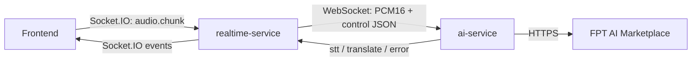

# Tích hợp Backend với AI Service

Tài liệu này mô tả contract hiện tại giữa:

- `frontend`: thu âm và gửi `audio.chunk` qua Socket.IO.
- `realtime-service`: quản lý phiên họp và làm cầu nối WebSocket.
- `ai-service`: ASR, dịch, RAG và quản lý ngữ cảnh.
- FPT AI Marketplace: ASR, quality translation, embedding và reranker.



## 1. Cấu hình

### AI service

Tạo `ai-service/.env` từ `.env.example`. Không commit file `.env`.

```env
AI_WS_HOST=127.0.0.1
AI_WS_PORT=8765

AUDIO_VAD=silero

FPT_BASE_URL=https://mkp-api.fptcloud.com
FPT_API_KEY=replace-with-your-key

FPT_ASR=true
FPT_ASR_MODEL=FPT.AI-whisper-large-v3-turbo
WHISPER_LANGUAGE=vi

FPT_AI_FACTORY_MODEL=SaoLa3.1-medium
FPT_AI_FACTORY_TIMEOUT=1.0

FPT_EMBEDDING=true
FPT_EMBEDDING_MODEL=Vietnamese_Embedding
FPT_RERANKER=true
FPT_RERANKER_MODEL=bge-reranker-v2-m3
```

`FPT_ASR=true` bắt buộc ASR đi qua FPT. Nếu FPT ASR lỗi, worker phát
event lỗi thay vì âm thầm sử dụng Whisper local.

`FAST_MT_MODEL` vẫn là fast translation chạy bằng Hugging Face/NLLB local.
Quality translation sử dụng FPT AI Marketplace.

### Realtime service

`realtime-service` cần biến môi trường:

```env
AI_WS_URL=ws://127.0.0.1:8765/ws/session
```

Trong container, thay `127.0.0.1` bằng hostname của container AI worker:

```env
AI_WS_URL=ws://ai-service:8765/ws/session
```

## 2. Khởi động

Chạy AI worker trước:

```powershell
cd ai-service
python -m pip install -r requirements.txt
python -m tests.test_smoke
python main.py --check
python main.py
```

Sau đó chạy backend:

```powershell
cd realtime-service
npm ci
npm test
npm run start:dev
```

`python main.py --check` preload VAD đã cấu hình và thoát khác `0` nếu thiếu
Torch hoặc không tải được Silero. Lệnh này không gọi API FPT thật. Production
giữ `AUDIO_VAD=silero`; khi cần cứu demo tạm thời có thể dùng
`AUDIO_VAD=energy`, là detector năng lượng NumPy có độ chính xác thấp hơn và
không được tự động bật. Chế độ này chỉ thay thế VAD; Whisper/NLLB local vẫn cần
Torch, còn các đường ASR/dịch FPT từ xa vẫn có thể nhận audio. Lần preload
Silero đầu tiên có thể tải model qua `torch.hub`; cần giữ cache Torch giữa các
lần deploy.

## 3. Vòng đời kết nối

Frontend kết nối Socket.IO tới `realtime-service` với các query parameter:

| Tham số | Bắt buộc | Mặc định |
| --- | --- | --- |
| `sessionId` | Có | Không có |
| `clientId` | Có | Không có |
| `domain` | Không | `business` |
| `languagePair` | Không | `vi-en` |
| `displayName` | Không | `clientId` |
| `localLanguage` | Không | Không có |

Backend mở một WebSocket riêng tới AI worker cho mỗi cặp
`sessionId/clientId`:

```text
ws://127.0.0.1:8765/ws/session?sessionId=...&clientId=...
```

Sau khi kết nối thành công, backend gửi:

```json
{
  "type": "session.init",
  "config": {
    "domain": "business",
    "languagePair": "vi-en"
  }
}
```

Backend chờ tối đa 5 giây để kết nối AI worker. Nếu thất bại, frontend nhận:

```json
{
  "code": "AI_UNAVAILABLE",
  "message": "The AI worker is unavailable."
}
```

## 4. Contract audio

Frontend gửi event Socket.IO:

```text
audio.chunk
```

Payload phải là binary audio với định dạng:

| Thuộc tính | Giá trị |
| --- | --- |
| Encoding | Signed PCM16 little-endian |
| Sample rate | 16.000 Hz |
| Channels | Mono |
| Container | Không có |

Không gửi WAV header, MP3, base64 hoặc JSON sang `audio.chunk`. Backend chuyển
nguyên binary payload sang AI worker.

Khi người nói đổi ngôn ngữ, frontend gửi:

```json
{
  "type": "speaker.switch",
  "speaker": "vi"
}
```

Giá trị `speaker` hợp lệ là `vi` hoặc `en`.

## 5. Event từ AI worker

Bridge hiện chỉ chấp nhận và forward năm event sau:

### `stt.partial`

```json
{
  "type": "stt.partial",
  "text": "xin chào",
  "speaker": "vi",
  "sourceLang": "vi",
  "stability": 0.6,
  "overlap": false,
  "utteranceId": "session-client-0"
}
```

### `stt.final`

```json
{
  "type": "stt.final",
  "text": "xin chào mọi người",
  "speaker": "vi",
  "sourceLang": "vi",
  "stability": 0.93,
  "overlap": false,
  "utteranceId": "session-client-0"
}
```

### `translate.token`

```json
{
  "type": "translate.token",
  "token": "Hello ",
  "utteranceId": "session-client-0"
}
```

### `translate.done`

```json
{
  "type": "translate.done",
  "fullText": "Hello everyone",
  "sourceText": "Xin chào mọi người",
  "speaker": "vi",
  "utteranceId": "session-client-0"
}
```

### `error`

```json
{
  "type": "error",
  "code": "AI_MODEL_UNAVAILABLE",
  "message": "The configured AI model is unavailable."
}
```

`realtime-service` gắn thêm `clientId` và `displayName`, sau đó broadcast event
vào Socket.IO room tương ứng với `sessionId`.

Chi tiết exception chỉ được ghi vào log AI worker cùng `sessionId`, `clientId`
và error code; không gửi đường dẫn dependency hoặc thông tin nội bộ tới client.

### Event nâng cao chưa được bridge forward

AI worker có thể phát:

- `stt.revision`
- `audio.overlap`
- `system.status`
- `rag.ingested`

Các event này hiện bị `AiBridgeService` bỏ qua vì chưa có trong
`SUPPORTED_AI_EVENTS`. Muốn frontend nhận được chúng, cần bổ sung type vào
`realtime-service/src/common/types/events.type.ts` và allowlist trong
`realtime-service/src/audio/ai-bridge.service.ts`.

## 6. Control message nội bộ

Backend có thể gửi JSON control qua WebSocket:

| `type` | Chức năng |
| --- | --- |
| `session.init` | Khởi tạo domain, language pair, glossary và documents |
| `speaker.switch` | Đổi ngôn ngữ người nói |
| `status.get` / `health.get` | Yêu cầu trạng thái worker |
| `rag.ingest` | Nạp tài liệu từ đường dẫn được phép |
| `session.close` | Xuất session và đóng pipeline |

Ví dụ RAG:

```json
{
  "type": "rag.ingest",
  "paths": ["./data/agenda.md"]
}
```

Mọi đường dẫn phải nằm trong `RAG_ALLOWED_ROOT`. Gateway hiện chưa expose
`rag.ingest` thành Socket.IO event công khai; đây mới là control message nội bộ.

## 7. Kiểm thử FPT ASR thủ công

File test có sẵn:

```powershell
cd ai-service
python tests/voice_api_manual.py --confirm-upload
```

Lệnh này:

1. Đọc các WAV trong `voice_test`.
2. Chuyển thành mono PCM16, 16 kHz.
3. Upload audio tới FPT ASR.
4. Ghi kết quả vào `voice_test/api_results.json`.
5. In trạng thái model local.

Kết quả đúng phải có:

```text
Backend: FPT API; local model loaded: False
```

Chỉ chạy lệnh khi dữ liệu voice được phép gửi tới FPT.

## 8. Xử lý lỗi

| Code | Nguồn | Ý nghĩa |
| --- | --- | --- |
| `AI_UNAVAILABLE` | Gateway | Không mở được kết nối tới AI worker |
| `AI_CONN_ERROR` | Bridge | WebSocket tới worker gặp lỗi |
| `AI_CONN_CLOSED` | Bridge | WebSocket đóng ngoài ý muốn |
| `INVALID_AUDIO_CHUNK` | Gateway | Payload không phải binary audio |
| `AI_MODEL_UNAVAILABLE` | Worker | Model hoặc FPT API không khả dụng |
| `AI_PIPELINE_ERROR` | Worker | Lỗi pipeline khác |
| `RAW_TRANSCRIPT` | Worker | Dịch thất bại, trả transcript gốc |

Không log API key hoặc nội dung audio. Ở production, cấp secret qua secret
manager và chỉ cho `ai-service` outbound tới `mkp-api.fptcloud.com:443`.

## 9. Checklist tích hợp

- [ ] AI worker lắng nghe tại port `8765`.
- [ ] `AI_WS_URL` trỏ đúng hostname từ môi trường chạy backend.
- [ ] `FPT_ASR=true` và API key có quyền dùng model ASR.
- [ ] Audio là raw PCM16 mono 16 kHz.
- [ ] Backend mở một AI WebSocket cho mỗi client trong session.
- [ ] Frontend xử lý `stt.partial`, `stt.final`, `translate.token`,
      `translate.done` và `error`.
- [ ] Voice đã được phép gửi tới FPT.
- [ ] Smoke test và manual API test đều pass trước khi deploy.
